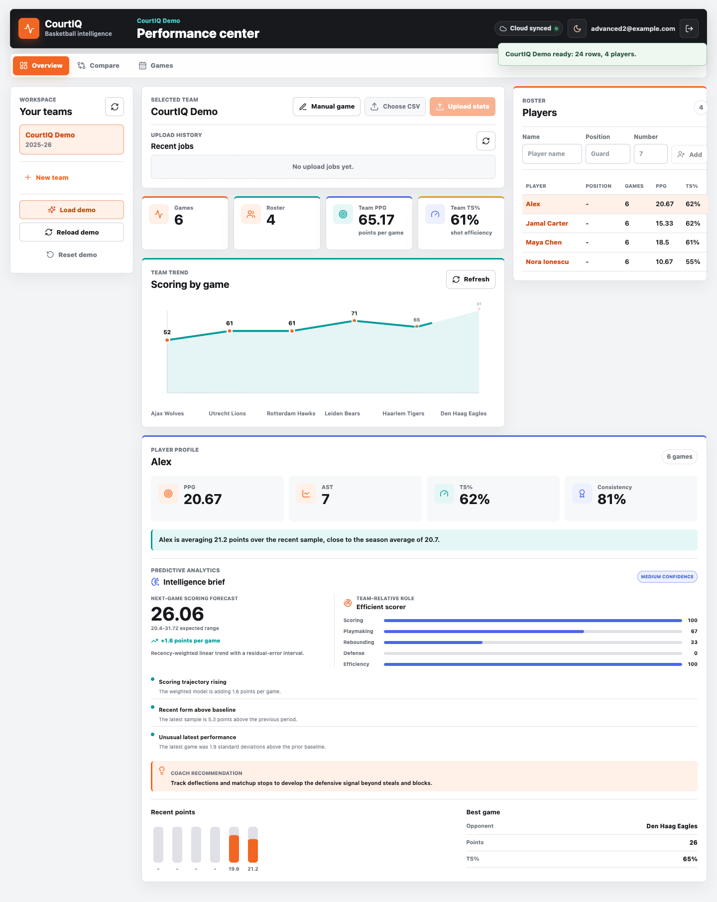
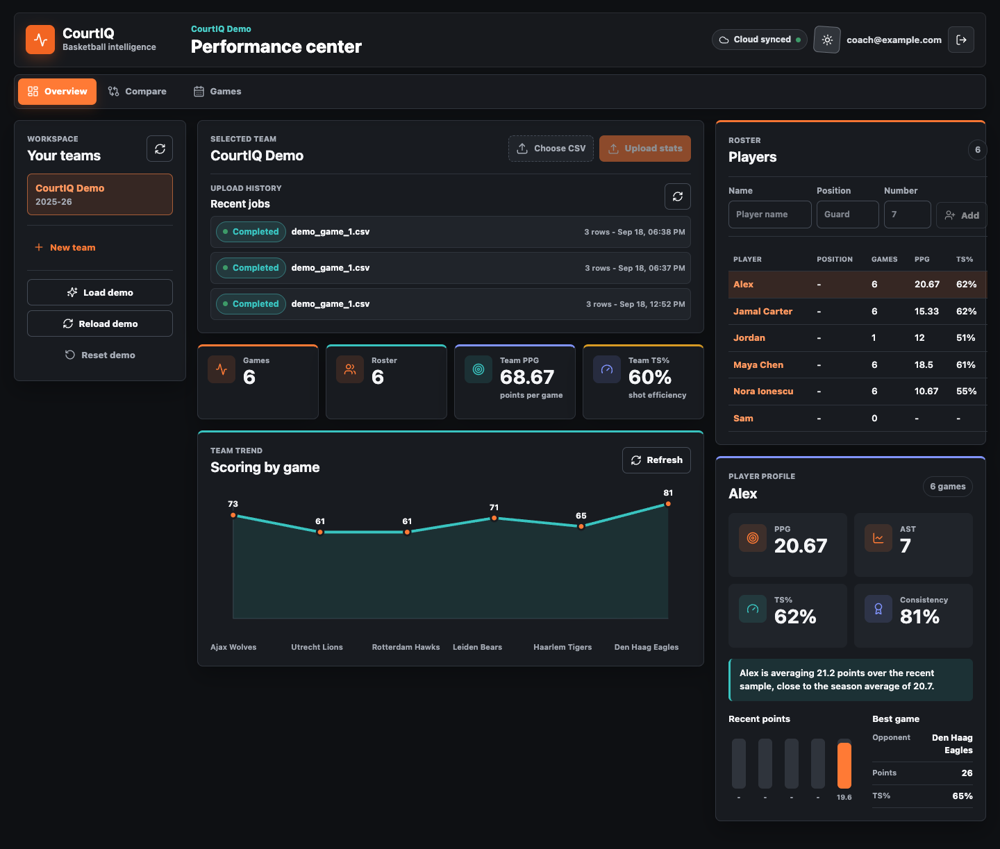

# CourtIQ

CourtIQ is a full-stack basketball analytics platform for coaches and players.

Coaches can upload CSV data or enter games manually, validate and store complete box scores, and turn them into team and player intelligence: efficiency metrics, forecasts, role profiles, change detection, recommendations, and dashboard views.

The project is built as a production-style portfolio application rather than a simple chart demo. It includes authentication, a relational data model, tested analytics logic, tracked CSV ingestion jobs, responsive product UI, and replaceable storage/queue adapters.

## Live Demo

- Application: [court-iq-ecru.vercel.app](https://court-iq-ecru.vercel.app/)
- API documentation: [courtiq-api-jqz4.onrender.com/docs](https://courtiq-api-jqz4.onrender.com/docs)
- Demo email: `coach@example.com`
- Demo password: `strong-password`

The Render Free backend sleeps after inactivity, so the first action can take a little longer while the API starts.





## Current Features

- Coach registration/login with JWT authentication.
- Coach-owned team workspaces.
- Team and player management.
- CSV box-score upload with validation.
- Manual game entry for selected roster players, with automatic point calculation and shooting consistency checks.
- `UploadJob` tracking with `pending`, `processing`, `completed`, and `failed` states.
- Upload history in the frontend.
- Team dashboard metrics and scoring trends.
- Player analytics: averages, efficiency, recent form, best/worst game, and summary text.
- Explainable next-game scoring forecasts using recency-weighted regression and residual-error prediction intervals.
- Team-relative player archetypes across scoring, playmaking, rebounding, defense, and efficiency.
- Automated trend, form, and outlier signals with targeted coach recommendations.
- Two-to-four player comparison with metric leaders and authenticated team boundaries.
- Game log with team totals, complete player box scores, and shooting efficiency.
- Print-ready game reports that export cleanly to PDF from the browser.
- Manual roster management from the coach workspace.
- Responsive desktop, split-screen, tablet, and mobile layouts.
- Persistent light and dark themes with reduced-motion-aware interface animation and animated analytics charts.
- Demo seed/reset flow for portfolio walkthroughs.
- Backend tests for metrics, validators, API workflows, storage, queueing, and upload processing.
- Docker Compose setup with PostgreSQL.
- Public deployment using Vercel, Render, and Supabase PostgreSQL.
- Persistent private CSV storage using Supabase Storage in production.
- Multi-tenant team naming, allowing each coach to maintain an independent workspace.

## Project Structure

```txt
CourtIQ/
├── backend/
│   ├── app/
│   │   ├── api/
│   │   │   └── routes/
│   │   ├── analytics/
│   │   ├── core/
│   │   ├── models/
│   │   ├── schemas/
│   │   ├── services/
│   │   ├── utils/
│   │   ├── workers/
│   │   └── main.py
│   ├── alembic/
│   ├── local_uploads/
│   ├── tests/
│   └── requirements.txt
├── frontend/
│   └── src/
│       ├── api/
│       ├── components/
│       └── types/
├── sample_data/
├── docs/
└── .github/
    └── workflows/
```

## Stack

- Backend: FastAPI, SQLAlchemy, Alembic, PostgreSQL, PyJWT
- Analytics: Python, weighted linear forecasting, percentile profiles, anomaly detection, typed validation
- Frontend: React, TypeScript, Vite
- DevOps: Docker Compose, GitHub Actions, Render, Vercel, local verification script
- Cloud: Supabase PostgreSQL with local and Supabase upload storage adapters

## Local Demo

Backend:

```bash
cd backend
venv/bin/python -m alembic -c alembic.ini upgrade head
venv/bin/python -m uvicorn app.main:app --reload
```

Frontend:

```bash
cd frontend
PATH=/Users/alexandrubogdan/.cache/codex-runtimes/codex-primary-runtime/dependencies/node/bin:/Users/alexandrubogdan/.cache/codex-runtimes/codex-primary-runtime/dependencies/bin:$PATH \
/Users/alexandrubogdan/.cache/codex-runtimes/codex-primary-runtime/dependencies/bin/pnpm dev
```

Open:

```txt
http://127.0.0.1:5173
```

## Docker Demo

```bash
docker compose up --build
```

Then open:

```txt
http://127.0.0.1:5173
```

The API docs are available at:

```txt
http://127.0.0.1:8000/docs
```

Docker Compose starts:

```txt
PostgreSQL on 5432
FastAPI on 8000
React preview on 5173
```

The backend runs Alembic migrations automatically before starting.

## Verification

```bash
scripts/check.sh
```

## Next Improvements

- Replace in-process background tasks with a durable external queue.
- Add shot-location data for zone efficiency and shot-quality modeling.
- Add rate limiting, audit logs, and richer role permissions.

See `docs/` for architecture notes, CSV format, metrics, backend status, and [deployment planning](docs/deployment.md).
